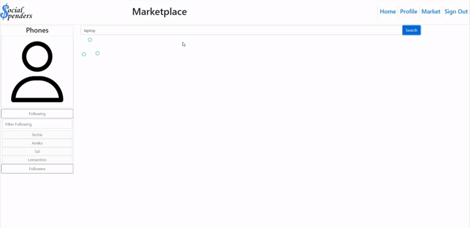

# Social-Spenders
This assignment was assigned by the U.C. Berkeley Extension Full-time Full Stack Flex Boot Camp. This is the third and final major project assigned by the program. In this assignment, I was tasked to create a fullstack application using React as the framework. I decided to build a Social Networking site where users can publicize their thoughts and purchases in the website.

The app contains notable features such as:
- Login and Signup function for users with account validation
- Home Feed to view the posts of all users on the site
- User view to view the profile of any of the users on the site
- A Self-profile view where the user can also edit the details of their account
- A Follow feature that allows the logged in user to keep track of users they decide to follow
- A Store page that accepts actual payment information through the Stripe API and records saved the information into a post publicized to the rest of the site

The program contains notable features such as:
- A RESTful API created by using Node.js and Express.js
- A Database hosted by MySQL and uses the Sequelize ORM
- GET and POST routes for retrieving and adding new data
- In app purchases served by the Stripe API
- Authentication with express-session and cookies
- Environment variables for API keys and other sensitive information
- Display rendered using React
- Deployed using Heroku




## Getting Started

This application is already deployed, however these instructions will get you a copy of the project up and running on your local machine for development and testing purposes.

### Prerequisites

Node.js is required.

### Installing
To install the necessary dependencies, run the npm installation command
```
npm install
```
Before launching the program you should also run the data seeding command
```
npm run seed
```

### Testing
There are no tests in this application.

### Usage
You can run the program on the command line with the following command:
```
npm start
```

## Built With
* [CSS](https://developer.mozilla.org/en-US/docs/Web/CSS)
* [Bootstrap](https://getbootstrap.com/)
* [Javascript](https://developer.mozilla.org/en-US/docs/Web/JavaScript)
* [Node.js](https://nodejs.org/en/docs/)
* [Express](https://expressjs.com/)
* [MySQL](https://dev.mysql.com/doc/)
* [Sequelize](https://sequelize.org/master/)
* [React](https://reactjs.org/)
* [React Bootstrap](https://react-bootstrap.github.io/)

Using the following APIs:
* [Stripe](https://stripe.com/docs/api)
* [Uploadcare](https://uploadcare.com/docs/)

Additional Backend Packages:
* [bcrypt](https://www.npmjs.com/package/bcrypt)
* [stripe](https://www.npmjs.com/package/stripe)

Additional Client Side Packages:
* [axios](https://www.npmjs.com/package/axios)
* [moment.js](https://www.npmjs.com/package/moment)
* [react-loader-spinner](https://www.npmjs.com/package/react-loader-spinner)
* [react-stripe-checkout](https://www.npmjs.com/package/react-stripe-checkout)

## Deployed Link

* [See Live Site](https://social-spenders.herokuapp.com/)

## Authors
AcedYu
- [Link to Github](https://github.com/AcedYu)
- [Link to LinkedIn](https://www.linkedin.com/in/alex-yu-3712811b9/)